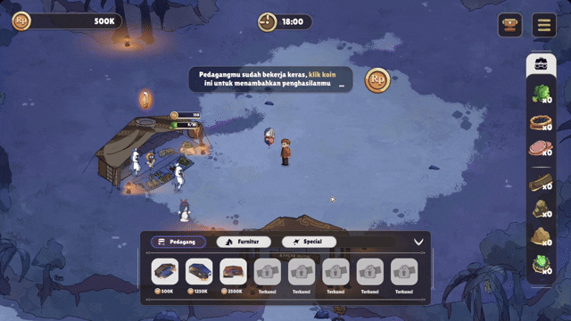
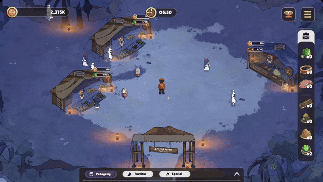
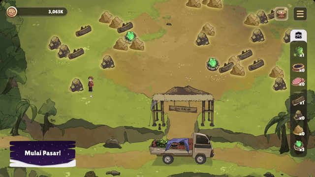

# Mystic Market Tycoon

## 🎮 Game Overview

  

    <i>
      Mystic Market! A business simulation game where you are the owner of a market land. This time, your customers are ghosts!
    </i>
  

  

    Mystic Market Tycoon is a business simulation game inspired by the local vibe of Indonesia’s urban ghost market. Enjoy a fun and unique experience as you become a market tycoon, protect your market from threats, and gather materials to make your market the most popular among ghosts!
  

---

## 🎬 Trailer

  

---

## 🧑‍💼 Introduction

Meet **Rojak**, a person with indigo abilities who often plays with his mystical friends. He frequently visits forests and mountains to meet them. Over time, Rojak realizes that the spirits in the mountains struggle to get supplies, unlike in the big city. Moved to help, Rojak opens the nearest traditional market.

---

## 🗝️ Key Information

|                |                                  |
|----------------|----------------------------------|
| **Game Title** | Mystic Market Tycoon             |
| **Genre**      | Role Playing, Simulation, Tycoon |
| **Looks**      | Folk, Fantasy, Cute              |
| **Audience**   | 9+ Age, Tycoon & Fun Game Fans   |
| **Device**     | PC                               |

---

## 🏆 Product Positioning

| Proven                        | Better                                                                 | New                                             |
|-------------------------------|------------------------------------------------------------------------|-------------------------------------------------|
| Market Management Tycoon      | Introduce new theme-based tycoon (mystic traditional market)           | Tycoon with quick battle & explore for events   |
| Theme-Based Game              | Serve a broader audience                                               |                                                 |
|                               | Tapping move mechanic instead of god view mode                         |                                                 |

---

## 🔄 Core Loop

**Night Session (18:00):**
- Buy stores
- Upgrade stores
- Protect from thugs
- Restock supplies
- Earn achievements & rewards
- Collect coins & items

**Morning Session (06:00):**
- Market closed
- Buy materials for restocking
- Explore the map to collect upgrade materials

---

## ✨ Features

### Merchant Placement  
Arrange the layout of your purchased stores anywhere on the market land.  

---

### In-Game Tutorial  
Helpful tutorials guide players throughout the gameplay.  
_See: `Assets/Script/TutorialManager`_

---

### NPC AI  
NPCs use coroutines to move between merchants and idle, creating a lively market atmosphere.  
_See: `Assets/Script/NpcAI`_

---

### Merchant Coin Collect  
Merchants accumulate coins when visited by NPCs, which players can collect.  

---

### A* Pathfinding  
Uses [A* Pathfinding Project](Assets/AstarPathfindingProject/Readme.txt) for realistic character movement.  

---

### Invoice  
Daily market reports are presented to the player.  
_See: `Assets/Script/InvoiceUI`_

---

### Collect Item & Inventory  
Morning exploration events allow players to gather various collectible materials for merchant upgrades.  

---

### Buy Item  
Purchase items to restock your merchants.  

---

### Restock & Upgrade Merchant 
Supply resources to keep stores open and prevent stockouts. Stores can be upgraded for more advanced strategies.  

---

### Minigame Pocin  
A minigame that helps Pocin put vegetables into a basket.  
_See: `Assets/Script/MinigamePocin`_

---

### Minigame Kunchan  
A minigame that helps Kunchan set the fire for cooking.  
_See: `Assets/Script/MinigameKunchan`_

---

### Minigame Ayang  
A minigame that helps Ayang choose the type of meat according to the question.  
_See: `Assets/Script/MinigameAyang`_

---

### Quick Event Battle  
Engage in click-spam battles against Uto the thug to protect your earnings.  

---

### Boss Final Battle  
Face Uwo, the urban legend, in a final click-spam battle to save your market.  

---

## 📁 Project Structure

- `Assets/Script/` — Main game scripts (Merchant, Player, NPC AI, Audio, etc.)
- `Assets/AstarPathfindingProject/` — Third-party pathfinding library
- `Assets/Animation/`, `Assets/Prefabs/`, `Assets/Font/`, etc. — Game assets

---

## 📜 License

- **Game Code & Assets:** See [MIT License](LICENSE).
- **A* Pathfinding Project:** See [Readme and LICENSE](Assets/AstarPathfindingProject/Readme.txt).

---

## 👥 Contributors

- [Muhammad Khalfani Abrar Fathir](https://github.com/mukafug) - Product Manager, Game Designer, 2D Background & Environment
- [Rifki Setiawan](https://github.com/rifkisetiawan0101) - Game Programmer
- [Bramantya Destalenta](https://www.behance.net/bramantdestale) - Game Programmer
- [Danang Aryaputra Giffary](https://www.behance.net/nangsen240danang) - 2D Character Designer, Animator
- [Ananda Sukma Rosdani](https://www.behance.net/anandasukma) - UI & UX Artist, Graphic Designer

---

> Mystic Market Tycoon is developed for learning and entertainment purposes. All third-party assets remain the property of their respective owners.
